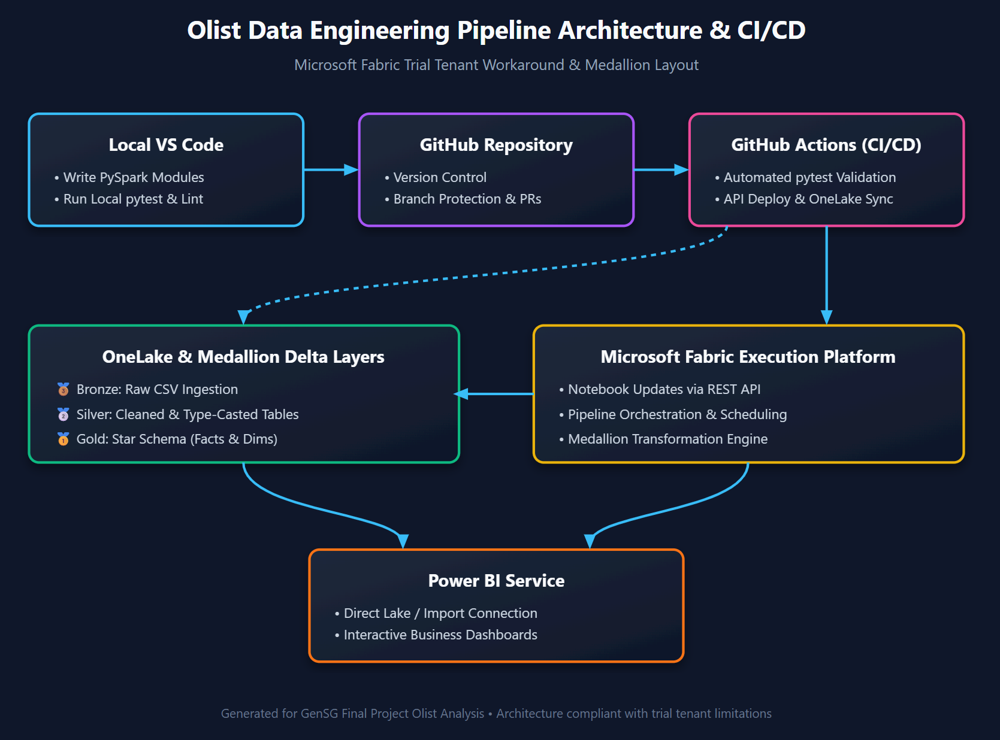

# GenSG Final Project: Olist Brazilian E-Commerce Analytics 

An end-to-end data engineering and analytics solution built by a team of 4 learners for the **Generation SG Data Engineering course**. This project transforms the **Olist Brazilian E-Commerce public dataset** into a robust, automated analytics pipeline using modern cloud data architecture, CI/CD deployment, and dimensional modeling.

---

## Team Members

1. **Tan Yj**
2. **Ana**
3. **Jie Shong**
4. **Jun Jie**

---

## Project Execution Phases

The project is executed across three structured engineering phases:

### Phase 1: Architecture Formulation, Ingestion & EDA
* **Architecture Design:** Defined and implemented the Microsoft Fabric **Medallion Lakehouse architecture (Bronze → Silver → Gold)**.
* **Data Ingestion & Preparation:** Established data platform connections, bulk-loaded raw sources into the Bronze layer, and performed Exploratory Data Analysis (EDA) to validate data quality and relationships.

### Phase 2: Dimensional Modeling & BI Design
* **Schema Design:** Built a comprehensive **Star Schema** complete with Primary/Foreign Keys (PK/FK), derived calculated fields, and a specialized event calendar dimension table.
* **Dashboard Conceptualization:** Designed an interactive business intelligence framework mapping directly to core business questions.

### Phase 3: CI/CD Deployment, Testing & Delivery
* **Local Testing & Validation:** Developed modular Python functions and executed rigorous unit tests via `pytest` locally before deployment.
* **Automated CI/CD Pipeline:** Configured GitHub Actions workflows to programmatically deploy code changes and pipeline assets into Microsoft Fabric.
* **Presentation & Delivery:** Deliver analytical models and present a data-driven business dashboard

## 📐 System Architecture & Workflow



---

## Technical Architecture & Principles

* **Medallion Lakehouse Layout:**
  * **Bronze Layer:** Raw ingestion of source CSV files with schema enforcement.
  * **Silver Layer:** Cleaned, type-casted, deduplicated, and flattened datasets.
  * **Gold Layer:** Optimized star schema fact and dimension tables ready for analytical consumption.
* **Engineering Standards:** Decoupled modular code structure (`src/`, `tests/`), safe and clean pipeline writes, defensive error handling, and github version control.

---

## Technical Stack

* **Cloud Data Platform:** Microsoft Fabric (Lakehouse, PySpark Notebooks, Data Pipelines, SQL Analytics Endpoint)
* **Programming & Testing:** Python (Pandas, PySpark, PyTest)
* **Version Control & CI/CD:** Git, GitHub, GitHub Actions
* **Visualization & BI:** Power BI Service / Desktop
* **Development Environment:** Visual Studio Code (VS Code)

---

## Comprehensive Project Structure

```text
├── .github/
│   └── workflows/
│       ├── ci.yml                 # Code quality and automated pytest execution
│       └── deploy-to-fabric.yml   # CI/CD pipeline deploying code to Microsoft Fabric
├── data/                          # Local sandbox for raw Olist CSVs and test exports
│   ├── raw/                       # 9 raw unedited source CSV files
│   └── processed/                 # Local validation outputs
├── fabric/                        # Microsoft Fabric workspace assets
│   ├── Olist_Lakehouse.Lakehouse/ # Lakehouse structure and delta definitions
│   ├── Bronze_Ingest.Notebook/    # Raw data landing PySpark scripts
│   ├── Silver_Clean.Notebook/     # Transformation and type-casting scripts
│   └── Gold_Star_Schema.Notebook/ # Dimensional fact and dimension table builders
├── src/                           # Reusable modular python source code
│   ├── __init__.py
│   ├── cleaning.py                # Reusable string-sanitization and transformation logic
│   └── validation.py              # Data quality assertions and quarantine rules
├── tests/                         # Automated unit test suite
│   ├── __init__.py
│   └── test_cleaning.py           # PyTest test cases for business logic
├── sql/                           # Analytical queries and validation views
├── notebooks/                     # Local Exploratory Data Analysis (EDA) notebooks
├── .gitignore                     # Excludes local credentials, raw data dumps, and cache
├── README.md                      # Project documentation and architecture guide
└── NOTES.md                       # Engineering log, design decisions, and data assumptions

## Data Source Inventory (Olist Dataset)

The pipeline integrates 9 core relational tables:

* **Customers (`olist_customers_dataset`)**: Unique IDs and customer zip code mapping.
* **Geolocation (`olist_geolocation_dataset`)**: Latitude, longitude, city, and state attributes.
* **Order Items (`olist_order_items_dataset`)**: Item-level pricing, freight costs, and seller allocations.
* **Payments (`olist_order_payments_dataset`)**: Payment types, installment counts, and transaction amounts.
* **Reviews (`olist_order_reviews_dataset`)**: Customer satisfaction scores and textual feedback.
* **Orders (`olist_orders_dataset`)**: End-to-end lifecycle timestamps (purchase, carrier dispatch, delivery).
* **Products (`olist_products_dataset`)**: Physical dimensions, weight, and category identifiers.
* **Sellers (`olist_sellers_dataset`)**: Marketplace vendor locations and structural metadata.
* **Category Translation (`product_category_name_translation`)**: Portuguese to English category mappings.

---

## Getting Started & Local Execution

### 1. Clone the Repository
```bash
git clone [https://github.com/your-username/GenSG_FinalProject_Olist_Analysis.git](https://github.com/your-username/GenSG_FinalProject_Olist_Analysis.git)
cd GenSG_FinalProject_Olist_Analysis

### 2. Run Local Unit Tests
Ensure your code changes pass validation rules prior to pushing:

```bash
pytest

### 3. Microsoft Fabric Execution
Deploy code via your configured GitHub Actions pipeline or execute the PySpark notebooks sequentially (`Bronze` → `Silver` → `Gold`) within your Microsoft Fabric workspace.